# Barton Peveril Sixth Form College - Data Model Diagrams

This document contains entity relationship diagrams, physical data models, and data flow diagrams for the data warehouse implementation.

## Table of Contents

1. [Source Schema](#1-source-schema)
   - [1.1 Entity Relationship Diagram](#11-entity-relationship-diagram)
   - [1.2 Physical Data Model](#12-physical-data-model)
2. [Warehouse Schema](#2-warehouse-schema)
   - [2.1 Entity Relationship Diagram](#21-entity-relationship-diagram)
   - [2.2 Physical Data Model](#22-physical-data-model)
3. [Data Flow Diagram](#3-data-flow-diagram)

---

## 1. Source Schema

The source schema captures data from operational systems including the ProSolution MIS, Focus prior attainment system, and external benchmarking providers (ALPS, Six Dimensions).

### 1.1 Entity Relationship Diagram

A logical entity relationship diagram showing core business entities, their attributes, and relationships. This diagram is database-agnostic and focuses on the business model.


### 1.2 Physical Data Model

A physical data model for Google BigQuery showing tables, columns, data types, primary keys, foreign keys, and constraints reflecting the actual implementation.

#### 1.2.1 ProSolution Core Tables


#### 1.2.2 External Source Tables

```mermaid
erDiagram
    raw_mis_applications_student_extended_data {
        INT64 student_extended_id PK "NOT NULL - Primary Key"
        INT64 student_id FK "NOT NULL - FK to student"
        STRING academic_year_id "Nullable"
        STRING nationality "Nullable"
        STRING country_of_birth "Nullable"
        STRING first_language "Nullable"
        STRING religion "Nullable"
        BOOL is_young_carer "Nullable"
        BOOL is_parent_carer "Nullable"
        STRING care_leaver_status "Nullable"
        STRING asylum_seeker_status "Nullable"
        STRING armed_forces_status "Nullable"
        STRING household_situation "Nullable"
        INT64 imd_decile "Nullable - 1-10"
        INT64 polar4_quintile "Nullable - 1-5"
        STRING tundra_classification "Nullable"
        TIMESTAMP _sdc_extracted_at "Nullable"
        TIMESTAMP _sdc_received_at "Nullable"
        TIMESTAMP _sdc_batched_at "Nullable"
        TIMESTAMP _sdc_deleted_at "Nullable"
    }

    raw_focus_average_gcse {
        INT64 average_gcse_id PK "NOT NULL - Primary Key"
        INT64 student_id FK "NOT NULL - FK to student"
        STRING academic_year_id "Nullable"
        NUMERIC average_gcse_score "Nullable - NUMERIC(8,2)"
        STRING gcse_english_grade "Nullable"
        STRING gcse_maths_grade "Nullable"
        INT64 gcse_count "Nullable"
        STRING data_source "Nullable"
        TIMESTAMP _sdc_extracted_at "Nullable"
        TIMESTAMP _sdc_received_at "Nullable"
        TIMESTAMP _sdc_batched_at "Nullable"
        TIMESTAMP _sdc_deleted_at "Nullable"
    }

    raw_alps_provider_report_a_level {
        INT64 alps_report_id PK "NOT NULL - Primary Key"
        STRING academic_year "NOT NULL"
        STRING subject_name "NOT NULL"
        INT64 student_count "Nullable"
        NUMERIC average_gcse_on_entry "Nullable - NUMERIC(8,2)"
        INT64 alps_grade "Nullable - 1-9"
        NUMERIC alps_score "Nullable - NUMERIC(5,2)"
        NUMERIC value_added_score "Nullable - NUMERIC(5,2)"
        STRING national_benchmark_grade "Nullable"
        NUMERIC pass_rate_pct "Nullable - NUMERIC(5,2)"
        NUMERIC high_grades_pct "Nullable - NUMERIC(5,2)"
        DATE report_date "Nullable"
        TIMESTAMP _sdc_extracted_at "Nullable"
        TIMESTAMP _sdc_received_at "Nullable"
        TIMESTAMP _sdc_batched_at "Nullable"
        TIMESTAMP _sdc_deleted_at "Nullable"
    }

    raw_alps_provider_report_btec {
        INT64 alps_btec_report_id PK "NOT NULL - Primary Key"
        STRING academic_year "NOT NULL"
        STRING subject_name "NOT NULL"
        STRING qualification_type "Nullable"
        INT64 student_count "Nullable"
        NUMERIC average_gcse_on_entry "Nullable - NUMERIC(8,2)"
        INT64 alps_grade "Nullable"
        NUMERIC alps_score "Nullable - NUMERIC(5,2)"
        NUMERIC value_added_score "Nullable - NUMERIC(5,2)"
        STRING national_benchmark_grade "Nullable"
        NUMERIC pass_rate_pct "Nullable - NUMERIC(5,2)"
        NUMERIC high_grades_pct "Nullable - NUMERIC(5,2)"
        DATE report_date "Nullable"
        TIMESTAMP _sdc_extracted_at "Nullable"
        TIMESTAMP _sdc_received_at "Nullable"
        TIMESTAMP _sdc_batched_at "Nullable"
        TIMESTAMP _sdc_deleted_at "Nullable"
    }

    raw_six_dimensions_va_report {
        INT64 va_report_id PK "NOT NULL - Primary Key"
        STRING academic_year "NOT NULL"
        STRING subject_name "Nullable"
        STRING qualification_type "Nullable"
        INT64 student_count "Nullable"
        NUMERIC average_gcse_on_entry "Nullable - NUMERIC(8,2)"
        NUMERIC value_added_score "Nullable - NUMERIC(8,4)"
        NUMERIC residual_score "Nullable - NUMERIC(8,4)"
        STRING expected_grade "Nullable"
        STRING actual_avg_grade "Nullable"
        STRING performance_band "Nullable"
        NUMERIC confidence_interval_lower "Nullable - NUMERIC(8,4)"
        NUMERIC confidence_interval_upper "Nullable - NUMERIC(8,4)"
        DATE report_date "Nullable"
        TIMESTAMP _sdc_extracted_at "Nullable"
        TIMESTAMP _sdc_received_at "Nullable"
        TIMESTAMP _sdc_batched_at "Nullable"
        TIMESTAMP _sdc_deleted_at "Nullable"
    }

    raw_six_dimensions_sixth_sense_report {
        INT64 sixth_sense_id PK "NOT NULL - Primary Key"
        STRING academic_year "NOT NULL"
        STRING subject_name "Nullable"
        STRING qualification_type "Nullable"
        INT64 student_count "Nullable"
        NUMERIC completion_rate_pct "Nullable - NUMERIC(5,2)"
        NUMERIC retention_rate_pct "Nullable - NUMERIC(5,2)"
        NUMERIC achievement_rate_pct "Nullable - NUMERIC(5,2)"
        NUMERIC pass_rate_pct "Nullable - NUMERIC(5,2)"
        NUMERIC high_grades_pct "Nullable - NUMERIC(5,2)"
        NUMERIC attendance_rate_pct "Nullable - NUMERIC(5,2)"
        NUMERIC national_completion_pct "Nullable - NUMERIC(5,2)"
        NUMERIC national_achievement_pct "Nullable - NUMERIC(5,2)"
        NUMERIC national_pass_pct "Nullable - NUMERIC(5,2)"
        STRING performance_quartile "Nullable"
        DATE report_date "Nullable"
        TIMESTAMP _sdc_extracted_at "Nullable"
        TIMESTAMP _sdc_received_at "Nullable"
        TIMESTAMP _sdc_batched_at "Nullable"
        TIMESTAMP _sdc_deleted_at "Nullable"
    }

    raw_six_dimensions_vocational_report {
        INT64 vocational_report_id PK "NOT NULL - Primary Key"
        STRING academic_year "NOT NULL"
        STRING subject_name "Nullable"
        STRING qualification_type "Nullable"
        STRING qualification_size "Nullable"
        INT64 student_count "Nullable"
        NUMERIC average_gcse_on_entry "Nullable - NUMERIC(8,2)"
        NUMERIC completion_rate_pct "Nullable - NUMERIC(5,2)"
        NUMERIC achievement_rate_pct "Nullable - NUMERIC(5,2)"
        NUMERIC pass_rate_pct "Nullable - NUMERIC(5,2)"
        NUMERIC distinction_star_pct "Nullable - NUMERIC(5,2)"
        NUMERIC distinction_pct "Nullable - NUMERIC(5,2)"
        NUMERIC merit_pct "Nullable - NUMERIC(5,2)"
        NUMERIC pass_pct "Nullable - NUMERIC(5,2)"
        NUMERIC near_pass_pct "Nullable - NUMERIC(5,2)"
        NUMERIC fail_pct "Nullable - NUMERIC(5,2)"
        NUMERIC national_achievement_pct "Nullable - NUMERIC(5,2)"
        NUMERIC national_distinction_plus_pct "Nullable - NUMERIC(5,2)"
        STRING performance_band "Nullable"
        DATE report_date "Nullable"
        TIMESTAMP _sdc_extracted_at "Nullable"
        TIMESTAMP _sdc_received_at "Nullable"
        TIMESTAMP _sdc_batched_at "Nullable"
        TIMESTAMP _sdc_deleted_at "Nullable"
    }

    raw_six_dimensions_jedi_report {
        INT64 jedi_report_id PK "NOT NULL - Primary Key"
        STRING academic_year "NOT NULL"
        STRING report_type "Nullable"
        STRING dimension_name "NOT NULL"
        STRING student_group "NOT NULL"
        STRING comparison_group "Nullable"
        INT64 student_count "Nullable"
        INT64 comparison_count "Nullable"
        NUMERIC student_avg_grade_points "Nullable - NUMERIC(8,2)"
        NUMERIC comparison_avg_grade_points "Nullable - NUMERIC(8,2)"
        NUMERIC gap_grade_points "Nullable - NUMERIC(8,2)"
        STRING gap_significance "Nullable"
        STRING performance_band "Nullable"
        DATE report_date "Nullable"
        TIMESTAMP _sdc_extracted_at "Nullable"
        TIMESTAMP _sdc_received_at "Nullable"
        TIMESTAMP _sdc_batched_at "Nullable"
        TIMESTAMP _sdc_deleted_at "Nullable"
    }
```



#### 1.2.3 Seed Reference Tables


---

## 2. Warehouse Schema

The warehouse schema implements a dimensional model (star schema) optimized for analytical queries and reporting on student performance, benchmarking, and equity analysis.

### 2.1 Entity Relationship Diagram

A logical entity relationship diagram showing the dimensional model with fact and dimension entities, their attributes, and relationships. This diagram is database-agnostic and focuses on the analytical business model.

```mermaid
erDiagram
    ACADEMIC_YEAR {
        string academic_year_key PK "Surrogate key"
        string academic_year_id NK "Natural key"
        string academic_year_name "Display name"
        date academic_year_start_date "Sept 1 start"
        date academic_year_end_date "Aug 31 end"
        integer calendar_year_start "Start year"
        integer calendar_year_end "End year"
        boolean is_current_year "Current year flag"
        integer years_from_current "Years from current"
    }

    OFFERING_TYPE {
        string offering_type_key PK "Surrogate key"
        string offering_type_id NK "Natural key"
        string offering_type_name "Type name"
        string offering_type_category "Academic or Vocational"
        string qualification_level "Level 3"
        string grading_scale "Grading scale"
        boolean is_academic "Academic flag"
        boolean is_vocational "Vocational flag"
    }

    COURSE_HEADER {
        string course_header_key PK "Surrogate key"
        string course_header_id NK "Natural key"
        string course_code "Course code"
        string course_name "Course name"
        string subject_area "Subject grouping"
        string department "Department"
        boolean is_active "Active flag"
    }

    OFFERING {
        string offering_key PK "Surrogate key"
        string offering_id NK "Natural key"
        string academic_year_id FK "Year context"
        string offering_type_id FK "Type reference"
        string course_header_id FK "Course reference"
        string offering_code "Offering code"
        string offering_name "Offering name"
        string qualification_id "Qualification ID"
        integer study_year "Year 1 or 2"
        integer duration_years "Programme length"
        boolean is_final_year "Final year flag"
        string alps_subject_name "ALPS mapping"
        string six_dimensions_subject_name "Six Dims mapping"
        string dfe_qualification_code "DfE code"
    }

    STUDENT {
        string student_key PK "Surrogate key"
        string student_id NK "Natural key"
        string uln "Unique Learner Number"
        string first_name "First name"
        string last_name "Last name"
        string full_name "Full name"
        date date_of_birth "DOB"
        string gender "Gender"
        string ethnicity "Ethnicity"
        boolean is_active "Active student"
        datetime first_enrolment_date "First enrolment"
        date valid_from_date "SCD2 start"
        date valid_to_date "SCD2 end"
        boolean is_current "Current version"
    }

    STUDENT_DETAIL {
        string student_detail_key PK "Surrogate key"
        string student_detail_id NK "Natural key"
        string student_id FK "Student reference"
        string academic_year_id FK "Year context"
        string full_name "Full name"
        string gender "Gender"
        string ethnicity "Ethnicity"
        boolean is_free_meals "FSM flag"
        boolean is_bursary "Bursary flag"
        boolean is_lac "LAC flag"
        boolean is_send "SEND flag"
        boolean is_high_needs "High needs flag"
        boolean is_young_carer "Young carer flag"
        string primary_send_type "SEND type"
        string postcode_area "Postcode area"
        integer imd_decile "IMD 1-10"
        integer polar4_quintile "POLAR4 1-5"
        string nationality "Nationality"
        string first_language "First language"
        decimal average_gcse_score "GCSE score"
        string prior_attainment_band "Low Mid High"
    }

    PRIOR_ATTAINMENT {
        string prior_attainment_key PK "Surrogate key"
        string average_gcse_id NK "Natural key"
        string student_id FK "Student reference"
        string academic_year_id FK "Year context"
        decimal average_gcse_score "Mean GCSE score"
        string prior_attainment_band "Band Low Mid High"
        integer prior_attainment_band_code "Band code 1-3"
        decimal low_threshold "Low band threshold"
        decimal high_threshold "High band threshold"
        integer gcse_english_grade "English grade"
        integer gcse_maths_grade "Maths grade"
        integer gcse_count "GCSE count"
    }

    GRADE {
        string grade_key PK "Surrogate key"
        string grade NK "Grade value"
        string grading_scale NK "Grading scale"
        integer ucas_points "UCAS points"
        integer grade_points "Internal points"
        integer grade_sort_order "Sort order"
        boolean is_high_grade "High grade flag"
        boolean is_pass_grade "Pass grade flag"
        boolean is_grade_a_star_to_a "Top two grades"
        boolean is_grade_a_star_to_b "Top three grades"
        boolean is_grade_a_star_to_c "Top four grades"
        boolean is_grade_a_star_to_e "Pass grades"
    }

    ENROLMENT_FACT {
        string enrolment_key PK "Surrogate key"
        string academic_year_key FK "Dim reference"
        string offering_type_key FK "Dim reference"
        string course_header_key FK "Dim reference"
        string offering_key FK "Dim reference"
        string student_key FK "Dim reference"
        string student_detail_key FK "Dim reference"
        string prior_attainment_key FK "Dim reference"
        string grade_key FK "Dim reference"
        string grade "Achieved grade"
        string target_grade "Target grade"
        string predicted_grade "Predicted grade"
        integer is_grade_a_star "Top grade count"
        integer is_grade_a "Grade A count"
        integer is_grade_b "Grade B count"
        integer is_high_grade "High grade count"
        integer is_pass "Pass count"
        decimal attendance_pct "Attendance"
        integer enrolment_count "Always 1"
        string completion_status "Status"
        boolean is_completed "Completed flag"
    }

    ALPS_SUBJECT_FACT {
        string alps_subject_performance_key PK "Surrogate key"
        string academic_year_key FK "Dim reference"
        string offering_key FK "Dim reference"
        string alps_subject_name "ALPS subject"
        string alps_qualification_type "Qualification type"
        string subject_mapping_status "Matched or Unmapped"
        decimal mapping_confidence_pct "Confidence 0-100"
        integer cohort_count "Cohort size"
        decimal average_gcse_on_entry "Entry GCSE"
        integer alps_band "ALPS band 1-9"
        decimal alps_score "ALPS score"
        decimal value_added_score "VA score"
        string national_benchmark_grade "Benchmark grade"
        decimal pass_rate_pct "Pass rate"
        decimal high_grades_pct "High grade rate"
    }

    COLLEGE_PERFORMANCE_FACT {
        string college_performance_key PK "Surrogate key"
        string academic_year_key FK "Dim reference"
        string report_type "Report type"
        string report_name "Report name"
        integer total_cohort_count "Total students"
        decimal avg_pass_rate_pct "Avg pass rate"
        decimal avg_high_grades_pct "Avg high grade rate"
        decimal avg_completion_rate_pct "Avg completion"
        decimal avg_retention_rate_pct "Avg retention"
        decimal avg_achievement_rate_pct "Avg achievement"
        decimal avg_attendance_rate_pct "Avg attendance"
        decimal avg_value_added_score "Avg VA"
    }

    SUBJECT_BENCHMARK_FACT {
        string subject_benchmark_key PK "Surrogate key"
        string academic_year_key FK "Dim reference"
        string offering_key FK "Dim reference"
        string report_type "Report type"
        string six_dimensions_subject_name "Subject name"
        string qualification_type "Qual type"
        string subject_mapping_status "Mapping status"
        integer cohort_count "Cohort size"
        decimal pass_rate_pct "Pass rate"
        decimal high_grades_pct "High grade rate"
        decimal value_added_score "VA score"
        string performance_band "Performance band"
        string performance_quartile "Quartile"
        string performance_trajectory "Trend"
        decimal yoy_change_pct "YoY change"
    }

    EQUITY_GAP_FACT {
        string equity_gap_key PK "Surrogate key"
        string academic_year_key FK "Dim reference"
        string report_type "Report type"
        string dimension_name "Gender Ethnicity etc"
        string student_group "Group analysed"
        string comparison_group "Comparison group"
        integer student_count "Group size"
        integer comparison_count "Comparison size"
        decimal student_avg_grade_points "Group grade pts"
        decimal comparison_avg_grade_points "Comparison pts"
        decimal gap_grade_points "Gap"
        string gap_significance "Significance"
        string performance_band "Band"
        decimal prior_year_gap "Prior gap"
        decimal gap_change_yoy "YoY change"
        string gap_trend "Narrowing Stable Widening"
    }

    %% Dimension relationships
    ACADEMIC_YEAR ||--o{ OFFERING : "year context"
    OFFERING_TYPE ||--o{ OFFERING : "categorizes"
    COURSE_HEADER ||--o{ OFFERING : "defines"
    STUDENT ||--o{ STUDENT_DETAIL : "yearly details"
    STUDENT ||--o{ PRIOR_ATTAINMENT : "attainment"

    %% Enrolment fact relationships
    ACADEMIC_YEAR ||--o{ ENROLMENT_FACT : "when"
    OFFERING_TYPE ||--o{ ENROLMENT_FACT : "what type"
    COURSE_HEADER ||--o{ ENROLMENT_FACT : "what course"
    OFFERING ||--o{ ENROLMENT_FACT : "what offering"
    STUDENT ||--o{ ENROLMENT_FACT : "who"
    STUDENT_DETAIL |o--o{ ENROLMENT_FACT : "demographics"
    PRIOR_ATTAINMENT |o--o{ ENROLMENT_FACT : "prior grades"
    GRADE |o--o{ ENROLMENT_FACT : "grade lookup"

    %% Benchmark fact relationships
    ACADEMIC_YEAR ||--o{ ALPS_SUBJECT_FACT : "when"
    OFFERING |o--o{ ALPS_SUBJECT_FACT : "mapping"
    ACADEMIC_YEAR ||--o{ COLLEGE_PERFORMANCE_FACT : "when"
    ACADEMIC_YEAR ||--o{ SUBJECT_BENCHMARK_FACT : "when"
    OFFERING |o--o{ SUBJECT_BENCHMARK_FACT : "mapping"
    ACADEMIC_YEAR ||--o{ EQUITY_GAP_FACT : "when"
```

### 2.2 Physical Data Model

A physical data model for Google BigQuery showing tables, columns, data types, primary keys, foreign keys, constraints, partitioning, and clustering reflecting the actual implementation.

#### 2.2.1 Dimension Tables


#### 2.2.2 Fact Tables


#### 2.2.3 BigQuery Table Options

| Table | Partition | Cluster Columns | Description |
|-------|-----------|-----------------|-------------|
| fct_enrolment | `academic_year_start_date` (YEAR) | `offering_key`, `student_key` | Most queries filter by year, then by offering or student |
| fct_alps_subject_performance | None | `academic_year_key`, `alps_subject_name` | Subject-level analysis queries |
| fct_college_performance | None | `academic_year_key`, `report_type` | Report filtering |
| fct_subject_benchmark | None | `academic_year_key`, `six_dimensions_subject_name` | Subject benchmarking queries |
| fct_equity_gap | None | `academic_year_key`, `dimension_name` | JEDI dimension analysis |

---

## 3. Data Flow Diagram

### 3.1 Layer Architecture

High-level view of the dbt layer architecture showing data transformation flow from source systems to the warehouse.


### 3.2 Detailed Transformation Flow

Detailed view showing specific model transformations and dependencies through each layer.


### 3.3 Model Execution Order

Simplified DAG showing the recommended dbt execution order.


---

## 4. Summary Tables

### 4.1 Source Schema Entity Summary

| Entity | Description | Primary Key | Key Relationships |
|--------|-------------|-------------|-------------------|
| Student | Student master record | student_id | Has details, extended data, enrolments |
| Student Detail | Yearly demographic snapshot | student_detail_id | Belongs to Student, Academic Year |
| Student Extended Data | Additional demographics | student_extended_id | Belongs to Student |
| Prior Attainment | GCSE scores | average_gcse_id | Belongs to Student |
| Course | Programme definition | course_header_id | Has Offerings |
| Offering Type | Qualification type | offering_type_id | Categorizes Offerings |
| Offering | Course instance per year | offering_id | Belongs to Course, Type; Has Enrolments |
| Completion Status | Enrolment status codes | completion_status_id | Status of Enrolments |
| Enrolment | Student on course | enrolment_id | Links Student to Offering |
| ALPS Report | External benchmarking | alps_report_id | Subject performance |
| Six Dimensions Reports | External benchmarking | report_id | Subject/college/equity data |

### 4.2 Warehouse Schema Entity Summary

| Entity | Type | Grain | Primary Key | Key Measures/Attributes |
|--------|------|-------|-------------|------------------------|
| dim_academic_year | Dimension | One per year | academic_year_key | is_current_year, years_from_current |
| dim_offering_type | Dimension | One per type | offering_type_key | grading_scale, is_academic, is_vocational |
| dim_course_header | Dimension | One per course | course_header_key | course_name, subject_area, department |
| dim_offering | Dimension | One per offering | offering_key | alps_subject_name, six_dimensions_subject_name |
| dim_student | Dimension | One per student | student_key | full_name, gender, ethnicity |
| dim_student_detail | Dimension | One per student/year | student_detail_key | is_free_meals, is_send, imd_decile |
| dim_prior_attainment | Dimension | One per student/year | prior_attainment_key | average_gcse_score, prior_attainment_band |
| dim_grade | Dimension | One per grade/scale | grade_key | ucas_points, is_high_grade, is_pass_grade |
| fct_enrolment | Fact | One per enrolment | enrolment_key | is_high_grade, is_pass, attendance_pct |
| fct_alps_subject_performance | Fact | One per subject/year | alps_subject_performance_key | alps_band, value_added_score |
| fct_college_performance | Fact | One per report/year | college_performance_key | avg_pass_rate_pct, avg_value_added_score |
| fct_subject_benchmark | Fact | One per subject/report/year | subject_benchmark_key | pass_rate_pct, performance_quartile |
| fct_equity_gap | Fact | One per dimension/year | equity_gap_key | gap_grade_points, gap_trend |

### 4.3 Join Key Reference

| From Table | To Table | Join Key(s) | Cardinality |
|------------|----------|-------------|-------------|
| fct_enrolment | dim_academic_year | academic_year_key | Many:1 |
| fct_enrolment | dim_offering_type | offering_type_key | Many:1 |
| fct_enrolment | dim_course_header | course_header_key | Many:1 |
| fct_enrolment | dim_offering | offering_key | Many:1 |
| fct_enrolment | dim_student | student_key | Many:1 |
| fct_enrolment | dim_student_detail | student_detail_key | Many:0..1 |
| fct_enrolment | dim_prior_attainment | prior_attainment_key | Many:0..1 |
| fct_enrolment | dim_grade | grade_key | Many:0..1 |
| fct_alps_subject_performance | dim_academic_year | academic_year_key | Many:1 |
| fct_alps_subject_performance | dim_offering | offering_key | Many:0..1 |
| fct_subject_benchmark | dim_academic_year | academic_year_key | Many:1 |
| fct_subject_benchmark | dim_offering | offering_key | Many:0..1 |
| fct_college_performance | dim_academic_year | academic_year_key | Many:1 |
| fct_equity_gap | dim_academic_year | academic_year_key | Many:1 |
