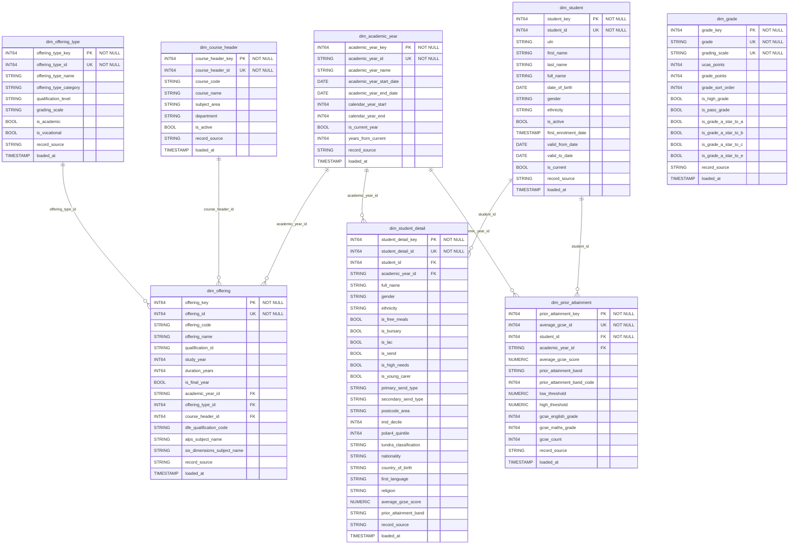
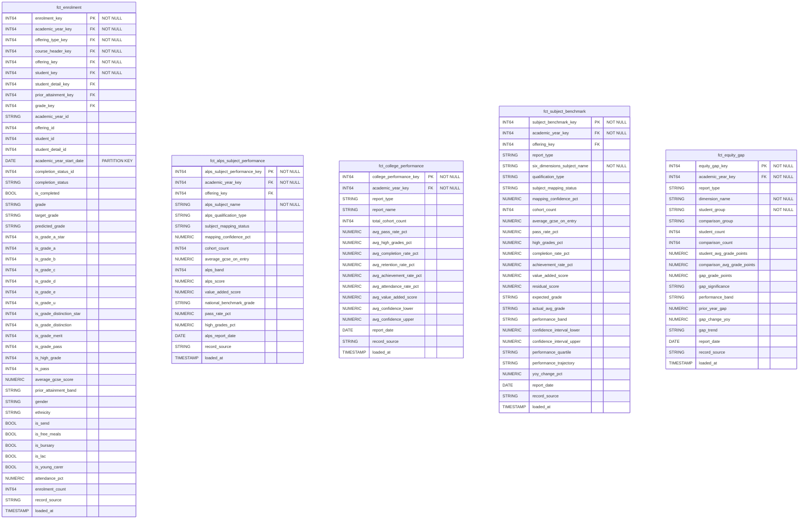

# Barton Peveril Sixth Form College - Data Model Diagrams

This document contains physical data model diagrams and data flow diagrams for the data warehouse implementation.

## Table of Contents

1. [Source Layer Physical Data Model](#1-source-layer-physical-data-model)
   - [ProSolution Source Tables](#11-prosolution-source-tables)
   - [External Source Tables](#12-external-source-tables)
2. [Warehouse Layer Physical Data Model](#2-warehouse-layer-physical-data-model)
   - [Dimension Tables](#21-dimension-tables)
   - [Fact Tables](#22-fact-tables)
   - [Star Schema Overview](#23-star-schema-overview)
3. [Data Flow Diagram](#3-data-flow-diagram)
   - [Layer Architecture](#31-layer-architecture)
   - [Detailed Transformation Flow](#32-detailed-transformation-flow)

---

## 1. Source Layer Physical Data Model

### 1.1 ProSolution Source Tables

The core MIS data from ProSolution including students, courses, and enrolments.

### 1.2 External Source Tables

Extended demographics, prior attainment, and external benchmarking data.

### 1.3 Seed Reference Tables

Static reference data loaded as dbt seeds.

---

## 2. Warehouse Layer Physical Data Model

### 2.1 Dimension Tables

### 2.2 Fact Tables

### 2.3 Star Schema Overview

Complete star schema showing fact-to-dimension relationships.

---

## 3. Data Flow Diagram

### 3.1 Layer Architecture

High-level view of the dbt layer architecture and data flow.

### 3.2 Detailed Transformation Flow

Detailed view showing specific model transformations and dependencies.

### 3.3 Model Dependency Graph

Simplified DAG showing model execution order.

---

## 4. Key Relationships Summary

### 4.1 Dimension Key Types

| Dimension | Surrogate Key | Natural Key(s) | Grain |
|-----------|---------------|----------------|-------|
| dim_academic_year | academic_year_key | academic_year_id | One row per academic year |
| dim_offering_type | offering_type_key | offering_type_id | One row per offering type |
| dim_course_header | course_header_key | course_header_id | One row per course |
| dim_offering | offering_key | offering_id | One row per offering |
| dim_student | student_key | student_id | One row per student |
| dim_student_detail | student_detail_key | student_detail_id | One row per student per year |
| dim_prior_attainment | prior_attainment_key | average_gcse_id | One row per student per year |
| dim_grade | grade_key | grade + grading_scale | One row per grade per scale |

### 4.2 Fact Table Grain and Measures

| Fact Table | Grain | Primary Measures |
|------------|-------|------------------|
| fct_enrolment | One row per student per offering | is_high_grade, is_pass, attendance_pct, enrolment_count |
| fct_alps_subject_performance | One row per subject per year | alps_band, alps_score, value_added_score, pass_rate_pct |
| fct_college_performance | One row per report type per year | avg_pass_rate_pct, avg_value_added_score |
| fct_subject_benchmark | One row per subject per report per year | pass_rate_pct, value_added_score, performance_quartile |
| fct_equity_gap | One row per demographic comparison per year | gap_grade_points, gap_trend |

### 4.3 External System Mapping

---

## 5. Partitioning and Clustering Strategy

### 5.1 Table Partitioning

| Table | Partition Column | Partition Type | Rationale |
|-------|------------------|----------------|-----------|
| fct_enrolment | academic_year_start_date | YEAR | Most queries filter by academic year |

### 5.2 Table Clustering

| Table | Cluster Columns | Rationale |
|-------|-----------------|-----------|
| fct_enrolment | offering_key, student_key | Common filter/join columns |
| fct_alps_subject_performance | academic_year_key, alps_subject_name | Subject-level analysis |
| fct_college_performance | academic_year_key, report_type | Report filtering |
| fct_subject_benchmark | academic_year_key, six_dimensions_subject_name | Subject benchmarking |
| fct_equity_gap | academic_year_key, dimension_name | JEDI dimension analysis |
